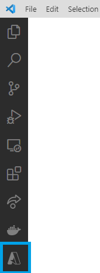
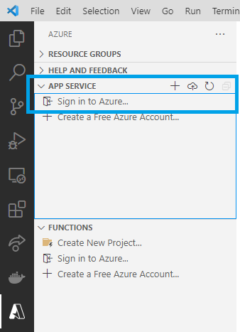
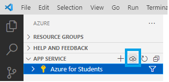

# Deploy your webapp to Azure
Open up Visual Studio Code and navigate to the Azure tab on the left and sign in to your Azure account:

 

Once you are logged in, select your subscription and click on `Deploy to Web App ...`

and work through the prompts given by VS Code:
1. Select the directory where your web app is located
2. Select the name of the WebApp you created in the Azure Portal where your code is to be deployed to

The deployment process may take a while. 
 
As soon as it is done you can navigate by browsing to \<YourWebappNameHere>.azurewebsites.net.